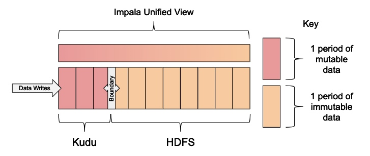

## 环境搭建
1. 安装CDH Manager，参考[官方教程](https://docs.cloudera.com/documentation/enterprise/6/6.0/topics/installation.html)
2. 在CDH中添加Flink, HDFS, Hive, Kafka, Kudu, Spark, YARN, ZooKeeper
   - HDFS注意关闭权限检查
3. 编译zeppelin与livy的parcels和csd，参考[livy_zeppelin_cdh_csd_parcels](https://github.com/alexjbush/livy_zeppelin_cdh_csd_parcels)
4. zeppelin与livy与CDH集成，参考[博客](https://www.itocm.com/a/3C84D18AE81B46BC80CF4AB64C8159F6)
5. [编译Flink Kudu Connector](https://github.com/apache/bahir-flink)
6. `pip install python-crontab`
7. `python -m script deploy slave1 slave2`

## 架构
- 实时etl: mock -> kafka -> flink -> kudu
  - event
  - profile
- 离线标签: crontab -> spark -> hive
  - 近一周新注册
  - 当天video访问量超过100
- kudu sink: crontab -> impala sql -> hive
- olap分析: impala -> hive, kudu
  - 查看notebook
  
- 数据表: 见[impala.sql](sql/impala.sql)

## 滑动窗口模式
### 技术选型
- HDFS Parquet: 列式存储结构
  - 适合OLAP场景，只读取需要的列，**更小的IO操作**
  - 适合存储历史大容量的，列式存储使得每个列高效的压缩和编码，**更高地压缩比**
- Kudu: HBase低延迟的记录级别随机读写与HDFS高吞吐量连续读取数据的能力的**平衡点**
  - 低延迟的更新，适用于**实时数据的快速入库**
  - 接近于Parquet的批量扫描性能，适用于**OLAP分析**
  - 快速插入更新，适用于**维度表**

### 存储分层

- Kudu: 保存一个月的Event数据
- HDFS: 保存剩下的历史数据
- Boundary: 滑动窗口的边界
- VIEW: Kudu和HDFS的统一视图


## 日志格式
```
60.165.39.1 - - [10/Nov/2016:00:01:53 +0800] "POST /course/ajaxmediauser HTTP/1.1" 200 54 "www.imooc.com" "http://www.imooc.com/code/1431" mid=1431&time=60 "Mozilla/5.0 (Windows NT 6.1; WOW64) AppleWebKit/537.36 (KHTML, like Gecko) Chrome/38.0.2125.122 Safari/537.36 SE 2.X MetaSr 1.0" "-" 10.100.136.64:80 200 0.014 0.014
14.145.74.175 - - [10/Nov/2016:00:01:53 +0800] "POST /course/ajaxmediauser/ HTTP/1.1" 200 54 "www.imooc.com" "http://www.imooc.com/video/678" mid=678&time=60&learn_time=551.5 "Mozilla/5.0 (Windows NT 6.1; WOW64) AppleWebKit/537.36 (KHTML, like Gecko) Chrome/45.0.2454.101 Safari/537.36" "-" 10.100.136.64:80 200 0.014 0.014
```

百度云盘下载地址：https://pan.baidu.com/s/1VfOG14mGW4P4kj20nzKx8g 提取码：uwjg

## 集群配置
- master
    - Mysql
    - HDFS NameNode
    - HDFS SecondaryNameNode
    - ZooKeeper Server
    - Kudu Master
    - YARN Resource Manager
    - Hive Metastore Server
    - HiveServer2
    - Hue Server
    - Impala Catalog Server
    - Impala StateStore
    - Impala Daemon
- slave1:
    - HDFS DataNode
    - Kafka Broker
    - YARN Node Manager
    - Kudu Tablet Server
    - ZooKeeper Server
    - Impala Daemon
- slave2:
    - HDFS DataNode
    - Kafka Broker
    - YARN Node Manager
    - Kudu Tablet Server
    - ZooKeeper Server
    - Impala Daemon
  
## 参考
1. [mooc日志分析系统](https://github.com/whirlys/BigData-In-Practice/tree/master/ImoocLogAnalysis)
2. [使用Apache Kudu和Impala实现存储分层](https://my.oschina.net/dabird/blog/3051625)